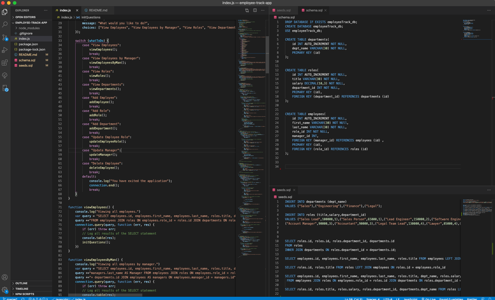
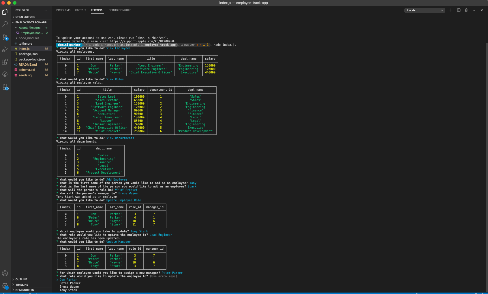

# Employee Track App

## An interface to keep track of employees  

  

## Table of Contents

* [Description](#description)
* [Installation](#installation)
* [Usage](#usage)
* [License](#license)
* [Contributing](#contribution)
* [Questions](#questions)

## Description 

This is an application that allows the user to input information in order to keep track of employees by details such as name, role, department, salary, etc. I made it to experiment with Node.js, the Inquirer npm package, and MySQL. Inquirer allows for the user to be prompted with different options and inputs, and MySQL allows for the storing of employee data that can be created, retrieved, updated, and deleted. [Click here for a video demo of the application](https://youtu.be/vEhLRPAsUUk).   

## Installation

To install and use the application, the npm Inquirer package and the MySQL package must be installed.

## Usage 

Once you have access to the application files, and you have installed the above NPM packages, simply use Node to run the index.js file in Terminal. As the user, you will be prompted with a series of questions that will guide you through the application. [Click here for a video demo of the application](https://youtu.be/vEhLRPAsUUk).

## License

This application is covered under a [MIT License](https://opensource.org/licenses/MIT).

## Contributing

I am very open to people suggesting improvements to this project. I can see ways that it currently can be improved, as it is by no means without bugs, but due to time restrictions, I will have to improve it at a later date. I welcome suggestions (see email below). If you do want to use it as a starting point for doing your own improvements, let me know how you go, as I'd be interested to hear.

## Questions

Got questions? Feel free to contact me.  
Github username: [domjparker](https://github.com/domjparker)  
Email address: dominic.j.parker@gmail.com

---

© 2020, Dominic Parker. All Rights Reserved.